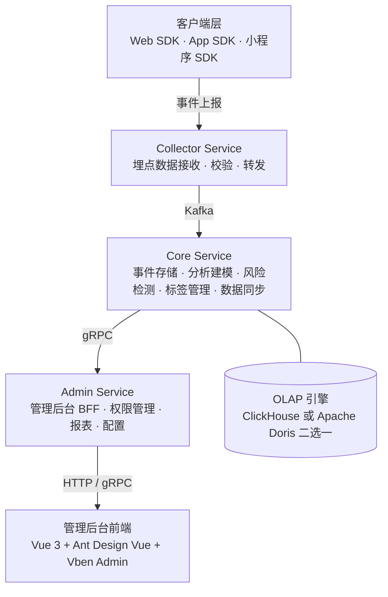

<p align="center">
  <h1 align="center">GoWind UBA · 风行用户行为分析平台</h1>
  <p align="center">
    开箱即用的企业级用户行为分析与商业智能平台
  </p>
  <p align="center">
    <em>让每一次用户行为都有迹可循，让每一份数据洞察触手可及</em>
  </p>
</p>

<p align="center">
  <a href="README.md">中文</a> · <a href="README_en.md">English</a> · <a href="README_ja.md">日本語</a>
</p>

<p align="center">
  
  
  
  
  
</p>

---

## 项目亮点

- **十大分析模型**：事件分析、漏斗分析、留存分析、归因分析、分布分析、用户路径分析、用户分群、点击分析、用户属性分析、行为序列分析，覆盖用户行为分析全场景
- **双引擎可切换数据仓库**：原生支持 ClickHouse 与 Apache Doris 两种 OLAP 引擎，按需二选一部署，极致查询性能
- **全链路事件采集**：自研 Web SDK，零代码埋点 + 自定义事件，数据经 Kafka 实时写入数仓
- **多租户架构**：租户数据物理隔离，自动初始化部门、角色与管理员，开箱即用
- **微服务架构**：基于 go-kratos 微服务框架，支持服务发现、链路追踪、分布式缓存
- **风险事件检测**：内置风险规则引擎，支持 Webhook 实时告警，守护业务安全
- **生产就绪**：JWT 鉴权、Casbin/OPA 权限引擎、SSE 消息推送、异步任务调度、Swagger 文档、Docker 一键部署

---

## 什么是 UBA？

**UBA**（User Behavior Analysis，用户行为分析）是一种数据分析技术，用于收集、分析和报告用户在网站、App 等数字产品上的行为。它可以帮助企业了解用户的偏好、习惯和行为模式，从而优化产品体验、提升转化率、实现精准营销。

> UBA 最早应用于电商领域，通过分析用户的点击、收藏、购买等行为，实现用户画像和精准营销推荐。随后被引入信息安全领域，通过多维度、长周期的关联分析和行为建模，发现潜在的安全威胁。

2015 年，UBA 演化为 **UEBA**（User and Entity Behavior Analytics，用户和实体行为分析），将分析范围从用户扩展到设备、应用程序、端点等所有实体，通过机器学习和统计模型自动建立行为基线，精准识别异常行为。

---

## 分析模型

| 模型         | 典型问题                               |
|------------|------------------------------------|
| **事件分析**   | 最近几个月来，哪个渠道的用户注册量最高？变化趋势如何？        |
| **漏斗分析**   | 从浏览产品，到点击支付的转化与流失情况如何？             |
| **留存分析**   | 新用户在注册后的第 1 天、第 7 天、第 30 天的留存率是多少？ |
| **归因分析**   | 是哪些运营位吸引了用户，让他们购买了这个产品？            |
| **分布分析**   | 揭示单个用户对产品的依赖程度，复购率如何？              |
| **用户路径分析** | 用户如何浏览你的产品？理想路径与实际路径偏差在哪？          |
| **用户分群**   | 过去 30 天购买产品的用户都有谁？如何制定定向营销策略？      |
| **点击分析**   | 用户都点击了哪个界面元素？哪个元素被高频点击？            |
| **用户属性分析** | 不同时间的注册用户数的变化趋势如何？用户按省份分布情况如何？     |
| **行为序列分析** | 用户未支付即流失。查看用户的历史行为记录，快速验证流失原因      |

---

## 技术栈

### 后端

| 层级      | 技术                        | 说明                  |
|---------|---------------------------|---------------------|
| 语言      | Go 1.25+                  | 高性能编译型语言            |
| 框架      | go-kratos v2              | B站开源微服务框架           |
| 依赖注入    | Wire                      | 编译时依赖注入             |
| ORM     | Ent                       | Go 实体框架（PostgreSQL） |
| OLAP 引擎 | ClickHouse / Apache Doris | 列式存储，极致分析性能         |
| 消息队列    | Kafka                     | 高吞吐事件流处理            |
| 缓存      | Redis                     | 内存数据库               |
| 对象存储    | MinIO                     | S3 兼容对象存储           |
| 服务注册    | Etcd / Consul             | 服务发现与配置             |
| 链路追踪    | Jaeger + OpenTelemetry    | 分布式可观测              |
| API 定义  | Protobuf + buf.build      | 接口契约优先              |
| 权限引擎    | Casbin / OPA              | 策略驱动鉴权              |
| 异步任务    | Asynq                     | 基于 Redis 的异步任务队列    |
| BI 平台   | Apache Superset           | 数据可视化与报表            |

### 管理后台前端

| 技术             | 说明         |
|----------------|------------|
| Vue 3          | 渐进式前端框架    |
| TypeScript     | 类型安全       |
| Ant Design Vue | 企业级 UI 组件库 |
| Vben Admin     | 后台管理框架     |
| Vite           | 新一代构建工具    |

### 数据采集 SDK

| SDK                  | 说明                   |
|----------------------|----------------------|
| Web SDK (JavaScript) | 网页端事件采集，支持自动埋点与自定义事件 |

---

## 系统架构



---

## 核心功能

### 数据采集与管理

| 功能   | 说明                                                 |
|------|----------------------------------------------------|
| 事件采集 | 支持自定义事件上报，Web SDK 零代码接入                            |
| 应用管理 | 管理采集应用，生成 AppID / AppKey，配置采集参数                    |
| 数据同步 | 同一份业务模型可落到 ClickHouse 或 Doris 任一引擎，字段、分区、索引、主键保持一致 |
| 会话管理 | 自动关联用户会话，支持会话级行为分析                                 |

### 分析模型

| 功能   | 说明                   |
|------|----------------------|
| 事件分析 | 多维度事件统计与趋势分析         |
| 漏斗分析 | 自定义漏斗步骤，计算转化率与流失率    |
| 留存分析 | 新用户 / 活跃用户留存，支持多时间粒度 |
| 归因分析 | 多触点归因，识别关键转化路径       |
| 分布分析 | 用户行为频次分布，揭示用户依赖度     |
| 路径分析 | 用户行为路径可视化，发现关键路径     |
| 用户分群 | 基于行为特征的用户分群，支持定向营销   |
| 点击分析 | 界面元素点击热力图分析          |
| 属性分析 | 用户属性多维度统计与趋势分析       |
| 行为序列 | 用户历史行为时序展示，快速定位问题    |

### 风险与安全

| 功能         | 说明                    |
|------------|-----------------------|
| 风险规则引擎     | 可视化配置风险检测规则，支持多维度条件组合 |
| 风险事件管理     | 自动检测风险事件，支持人工审核与处理    |
| Webhook 告警 | 风险事件实时推送至第三方系统        |

### 组织与权限

| 功能    | 说明                       |
|-------|--------------------------|
| 多租户管理 | 租户数据隔离，自动初始化部门、角色与管理员    |
| 用户管理  | 用户全生命周期管理，支持多角色、多部门绑定    |
| 角色管理  | 精细化配置菜单权限、接口权限与数据权限      |
| 权限管理  | 权限分组、菜单节点与权限点管理，支持按钮级控制  |
| 字典管理  | 数据字典大类与子项管理，联动查询、排序、导入导出 |

### 系统运维

| 功能   | 说明                       |
|------|--------------------------|
| 文件管理 | 文件上传至 OSS 或本地，支持预览、下载、删除 |
| 缓存管理 | 缓存实时查询，按键精准清除或批量清理       |
| 消息通知 | 多级消息分类，向指定用户发送站内消息       |
| 登录日志 | 登录成功/失败日志，含 IP、设备、时间     |
| 操作日志 | 全链路操作日志，支持详情追溯           |
| 任务调度 | 定时任务管理，支持启动/暂停/立即执行      |

---

## 项目结构

```
go-wind-uba/
├── backend/                            # 后端项目
│   ├── api/                            # Protobuf API 定义与生成代码
│   │   ├── protos/                     # .proto 源文件（按领域分层）
│   │   │   ├── admin/                  # 管理后台接口
│   │   │   ├── audit/                  # 审计接口
│   │   │   ├── authentication/         # 认证接口
│   │   │   ├── collector/              # 数据采集接口
│   │   │   ├── dict/                   # 字典接口
│   │   │   ├── identity/               # 身份接口
│   │   │   ├── internal_message/       # 站内消息接口
│   │   │   ├── permission/             # 权限接口
│   │   │   ├── resource/               # 资源接口
│   │   │   ├── storage/                # 文件存储接口
│   │   │   ├── task/                   # 任务接口
│   │   │   └── uba/                    # UBA 核心接口
│   │   └── gen/go/                     # buf 生成的 Go 代码
│   ├── app/                            # 服务应用
│   │   ├── admin/service/              # Admin 服务（管理后台 BFF）
│   │   ├── collector/service/          # Collector 服务（埋点采集 BFF）
│   │   └── core/service/               # Core 服务（核心业务逻辑）
│   ├── pkg/                            # 公共包
│   │   ├── authorizer/                 # 鉴权引擎
│   │   ├── constants/                  # 常量定义
│   │   ├── crypto/                     # 加密工具（AES-GCM）
│   │   ├── jwt/                        # JWT 工具
│   │   ├── metadata/                   # 元数据管理
│   │   ├── middleware/                 # 中间件（鉴权/日志/Ent/元数据）
│   │   ├── oss/                        # 对象存储（MinIO）
│   │   ├── serviceid/                  # 服务标识
│   │   ├── task/                       # 异步任务
│   │   ├── topic/                      # Kafka Topic 管理
│   │   └── utils/                      # 通用工具
│   ├── sql/                            # 数据库脚本
│   │   ├── clickhouse/                 # ClickHouse 建表脚本
│   │   ├── doris/                      # Doris 建表脚本
│   │   └── postgresql/                 # PostgreSQL 建表脚本
│   ├── scripts/                        # 部署脚本
│   │   ├── deploy/                     # PM2 部署脚本
│   │   ├── docker/                     # Docker 部署脚本
│   │   └── env/                        # 环境安装脚本
│   └── docs/                           # 文档
├── frontend/                           # 前端项目
│   ├── admin/                          # 管理后台（Vue 3 + Vben Admin）
│   └── sdk/web/                        # Web 数据采集 SDK
└── LICENSE                             # MIT 开源许可
```

---

## 快速开始

### 环境要求

| 工具      | 版本         |
|---------|------------|
| Go      | 1.25+      |
| Node.js | >= 20.10.0 |
| pnpm    | >= 9.12.0  |
| Docker  | 20.0+      |
| buf     | 最新版        |

### 环境脚本

- **Linux / macOS 开发环境**：`scripts/env/install_unix_dev.sh`
- **Linux / macOS 生产环境**：`scripts/env/install_unix_prod.sh`
- **Windows 开发环境**：`scripts/env/install_windows_dev.ps1`

### Docker 两种部署模式

- **full_deploy 完整模式**：同步启动中间件 + 后端应用，适用于一键演示、生产部署
- **libs_only 依赖模式（推荐开发）**：仅启动中间件，应用本地 IDE 运行调试

### 1. 启动依赖服务

Linux / macOS：

```bash
cd backend

# 赋予脚本执行权限
chmod +x scripts/**/*.sh

# 仅启动中间件依赖（推荐开发）
./scripts/docker/libs_only.sh

# 一键完整部署（中间件 + 后端服务）
./scripts/docker/full_deploy.sh
```

Windows（PowerShell 管理员）：

```powershell
cd backend

# 放行脚本策略（首次仅需执行一次）
Set-ExecutionPolicy RemoteSigned -Scope CurrentUser

# 仅启动中间件依赖（推荐开发）
.\scripts\docker\libs_only.ps1

# 一键完整部署（中间件 + 后端服务）
.\scripts\docker\full_deploy.ps1
```

### 2. 启动后端服务

```bash
cd backend

# 安装依赖
go mod tidy

# 初始化开发环境（安装 protoc 插件和 CLI 工具）
make init

# 生成代码（ent + wire + api + openapi）
make gen

# 构建所有服务
make build

# 运行 Core 服务
go run ./app/core/service/cmd/server/ -c ./app/core/service/configs

# 运行 Admin 服务
go run ./app/admin/service/cmd/server/ -c ./app/admin/service/configs

# 运行 Collector 服务
go run ./app/collector/service/cmd/server/ -c ./app/collector/service/configs
```

### 3. 初始化数据库

执行 `sql/` 目录下的建表脚本：

```bash
# PostgreSQL（业务库）
psql -h localhost -U postgres -d gwubd -f sql/postgresql/schema.sql

# ClickHouse（分析引擎，与 Doris 二选一）
clickhouse-client --queries-file sql/clickhouse/schema.sql

# Doris（分析引擎，与 ClickHouse 二选一）
mysql -h localhost -P 9030 -u root < sql/doris/schema.sql
```

### 4. 启动前端

```bash
cd frontend/admin

# 安装依赖
pnpm install

# 启动开发服务器
pnpm dev
```

### 常用命令

```bash
cd backend

# 生成 Protobuf API 代码
make api

# 生成 OpenAPI 文档
make openapi

# 生成 TypeScript 代码
make ts

# 一键生成全部代码（ent + wire + api + openapi）
make gen

# 构建所有服务
make build

# 运行测试
make test

# 代码检查
make lint

# Docker Compose 启动依赖
make docker-libs

# Docker Compose 完整部署
make docker-up
```

---

## 后端服务说明

| 服务                    | 说明                                     | 端口                      |
|-----------------------|----------------------------------------|-------------------------|
| **Core Service**      | 核心业务服务，负责事件存储、分析建模、风险检测、标签管理、数据同步等核心逻辑 | -                       |
| **Admin Service**     | 管理后台 BFF，提供用户管理、权限管理、配置管理、报表查询等接口      | HTTP: 9700 / gRPC: 9701 |
| **Collector Service** | 埋点采集 BFF，接收客户端事件上报数据，校验并转发至消息队列        | HTTP: 9800 / gRPC: 9801 |

---

## OLAP 引擎选型与 Schema 设计

- **ClickHouse 与 Apache Doris 为二选一关系**，部署时按需选择其一作为分析引擎即可，运行时通过 `data.UseClickHouse` 配置项切换
- 两种引擎共用同一份业务模型，字段、分区、索引、主键定义保持一致
- 支持 struct 定义自动生成、注解（json、ch）自动处理
- 支持批量数据写入，严格模式下自动补齐 NOT NULL 字段
- 落库后可进一步优化字段类型、索引、分区等，参考 `backend/sql/` 脚本

---

## Web SDK 接入

```html
<script type="text/javascript" src="report_sdk.js"></script>
<script type="text/javascript">
    // 初始化（单例模式）
    // 参数：采集服务地址, AppID, AppKey, 调试模式
    // 调试模式：0=正常入库, 1=测试入库, 2=测试不入库
    const tracker = new EventReport(
        "http://localhost:9800",
        "your_app_id",
        "your_app_key",
        0
    );

    // 设置全局属性
    tracker.setSuperProperties({ platform: "web", version: "1.0.0" });

    // 上报自定义事件
    tracker.track("page_view", { page: "/home", title: "首页" });

    // 上报用户属性
    tracker.userSet({ name: "张三", vip_level: 3 }).trackUserData();
</script>
```

> 详见 [Web SDK 文档](frontend/sdk/web/README.md)

---

## 参考资料

- [铸龙-BI（用户事件分析平台）](https://www.yuque.com/jianghurenchenggolang/oehqme/hen7qy#JFdyf)
- [做产品经理，你必须要掌握的AARRR模型！](https://www.woshipm.com/operate/5460612.html)
- [用户行为分析与BI的区别？请拿好这份指南！](https://www.niutoushe.com/54408)
- [掌握这几个重点，轻松搞定用户行为分析思路！](https://www.fanruan.com/bw/zwoz)
- [什么是商业智能 (BI)？](https://www.sap.cn/products/technology-platform/cloud-analytics/what-is-business-intelligence-bi.html)
- [Business Intelligence in Microservices: Improving Performance](https://dzone.com/articles/business-intelligence-in-microservices-improving-p)
- [ClickHouse 在实时场景的应用和优化](https://mp.weixin.qq.com/s/hqUCFSr8cu3x3u8HCA6WYg)

---

## 相关项目

- [go-wind-admin](https://github.com/tx7do/go-wind-admin) — 开箱即用的企业级前后端一体中后台脚手架
- [go-wind-cms](https://github.com/tx7do/go-wind-cms) — 开箱即用的企业级前后端一体内容平台

---

## 联系我们

- 微信个人号：yang_lin_bo（备注：go-wind-uba）

---

## 开源许可

本项目基于 [MIT License](LICENSE) 开源。

## 致谢

[](https://jb.gg/OpenSource)

感谢 JetBrains 提供的免费 GoLand & WebStorm 开源许可。
