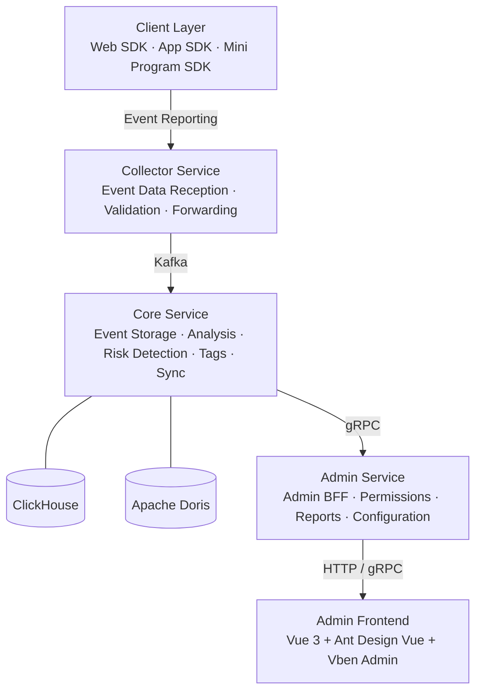

<p align="center">
  <h1 align="center">GoWind UBA · User Behavior Analytics Platform</h1>
  <p align="center">
    An out-of-the-box enterprise-grade User Behavior Analytics & Business Intelligence platform
  </p>
  <p align="center">
    <em>Make every user action traceable, every data insight accessible</em>
  </p>
</p>

<p align="center">
  <a href="README.md">中文</a> · <a href="README_en.md">English</a> · <a href="README_ja.md">日本語</a>
</p>

<p align="center">
  
  
  
  
  
</p>

---

## Highlights

- **10 Analysis Models**: Event Analysis, Funnel Analysis, Retention Analysis, Attribution Analysis, Distribution Analysis, User Path Analysis, User Segmentation, Click Analysis, User Attribute Analysis, and Behavior Sequence Analysis — covering the full spectrum of user behavior analytics
- **Dual OLAP Engines**: Native support for both ClickHouse and Apache Doris, freely switchable with extreme query performance
- **Full-Link Event Collection**: Custom Web SDK with zero-code auto-tracking and custom events, real-time data ingestion via Kafka into data warehouse
- **Multi-Tenancy**: Tenant data isolation with automatic initialization of departments, roles, and administrators — ready out of the box
- **Microservice Architecture**: Built on go-kratos microservice framework with service discovery, distributed tracing, and distributed caching
- **Risk Detection**: Built-in risk rule engine with Webhook real-time alerts to safeguard your business
- **Production Ready**: JWT authentication, Casbin/OPA authorization, SSE push notifications, async task scheduling, Swagger docs, and one-click Docker deployment

---

## What is UBA?

**UBA** (User Behavior Analytics) is a data analysis technique for collecting, analyzing, and reporting user behavior on websites, apps, and other digital products. It helps businesses understand user preferences, habits, and behavioral patterns to optimize product experiences, increase conversion rates, and achieve precision marketing.

> UBA was first applied in e-commerce — analyzing clicks, favorites, and purchases to build user profiles and enable targeted recommendations. It was later adopted in information security, using multi-dimensional, long-cycle correlation analysis and behavioral modeling to detect potential security threats.

In 2015, UBA evolved into **UEBA** (User and Entity Behavior Analytics), extending the analysis scope from users to all entities including devices, applications, and endpoints. It leverages machine learning and statistical models to automatically establish behavioral baselines and precisely identify anomalous behaviors.

---

## Analysis Models

| Model | Typical Question |
| --- | --- |
| **Event Analysis** | Which channel has the highest user registrations in recent months? What's the trend? |
| **Funnel Analysis** | What's the conversion and drop-off rate from browsing to payment? |
| **Retention Analysis** | What's the retention rate for new users on Day 1, Day 7, and Day 30? |
| **Attribution Analysis** | Which campaign placements attracted users to purchase a product? |
| **Distribution Analysis** | How dependent are individual users on the product? What's the repurchase rate? |
| **User Path Analysis** | How do users navigate your product? Where does the actual path deviate from ideal? |
| **User Segmentation** | Who are the users who purchased in the past 30 days? How to create targeted marketing? |
| **Click Analysis** | Which UI elements do users click on? Which elements have the highest click frequency? |
| **User Attribute Analysis** | What's the registration trend over time? How are users distributed by region? |
| **Behavior Sequence** | A user abandoned without paying. Review their behavior history to identify the cause |

---

## Tech Stack

### Backend

| Layer | Technology | Description |
| --- | --- | --- |
| Language | Go 1.25+ | High-performance compiled language |
| Framework | go-kratos v2 | Bilibili open-source microservice framework |
| Dependency Injection | Wire | Compile-time dependency injection |
| ORM | Ent | Go entity framework (PostgreSQL) |
| OLAP Engine | ClickHouse / Apache Doris | Columnar storage for extreme analytical performance |
| Message Queue | Kafka | High-throughput event stream processing |
| Cache | Redis | In-memory database |
| Object Storage | MinIO | S3-compatible object storage |
| Service Registry | Etcd / Consul | Service discovery & configuration |
| Tracing | Jaeger + OpenTelemetry | Distributed observability |
| API Definition | Protobuf + buf.build | Contract-first API design |
| Authorization | Casbin / OPA | Policy-driven access control |
| Async Tasks | Asynq | Redis-based async task queue |
| BI Platform | Apache Superset | Data visualization & reporting |

### Admin Frontend

| Technology | Description |
| --- | --- |
| Vue 3 | Progressive frontend framework |
| TypeScript | Type-safe development |
| Ant Design Vue | Enterprise UI component library |
| Vben Admin | Admin dashboard framework |
| Vite | Next-generation build tool |

### Data Collection SDK

| SDK | Description |
| --- | --- |
| Web SDK (JavaScript) | Browser event collection with auto-tracking and custom events |

---

## System Architecture



---

## Core Features

### Data Collection & Management

| Feature | Description |
| --- | --- |
| Event Collection | Custom event reporting with zero-code Web SDK integration |
| Application Management | Manage collection apps, generate AppID/AppKey, configure collection parameters |
| Data Sync | ClickHouse ↔ Doris bidirectional schema auto-sync with consistent fields, partitions, and indexes |
| Session Management | Auto-correlate user sessions for session-level behavior analysis |

### Analysis Models

| Feature | Description |
| --- | --- |
| Event Analysis | Multi-dimensional event statistics and trend analysis |
| Funnel Analysis | Custom funnel steps with conversion and drop-off rates |
| Retention Analysis | New/active user retention with multiple time granularities |
| Attribution Analysis | Multi-touch attribution to identify key conversion paths |
| Distribution Analysis | User behavior frequency distribution revealing dependency levels |
| Path Analysis | User behavior path visualization for discovering critical paths |
| User Segmentation | Behavior-based user grouping for targeted marketing |
| Click Analysis | UI element click heatmap analysis |
| Attribute Analysis | Multi-dimensional user attribute statistics and trend analysis |
| Behavior Sequence | User behavior timeline for quick issue identification |

### Risk & Security

| Feature | Description |
| --- | --- |
| Risk Rule Engine | Visual risk detection rule configuration with multi-dimensional conditions |
| Risk Event Management | Automated risk event detection with manual review and handling |
| Webhook Alerts | Real-time risk event push notifications to third-party systems |

### Organization & Permissions

| Feature | Description |
| --- | --- |
| Multi-Tenant Management | Tenant data isolation with auto-initialized departments, roles, and admins |
| User Management | Full user lifecycle management with multi-role and multi-department binding |
| Role Management | Fine-grained menu, API, and data permission configuration |
| Permission Management | Permission groups, menu nodes, and button-level access control |
| Dictionary Management | Data dictionary categories and items with linked queries, sorting, import/export |

### System Operations

| Feature | Description |
| --- | --- |
| File Management | Upload to OSS or local storage with preview, download, and delete |
| Cache Management | Real-time cache querying with precise or batch clearing |
| Notifications | Multi-level message categories with targeted user messaging |
| Login Logs | Login success/failure logs with IP, device, and timestamp |
| Operation Logs | Full-chain operation logs with detail tracing |
| Task Scheduling | Scheduled task management with start/pause/execute-now support |

---

## Project Structure

```
go-wind-uba/
├── backend/                            # Backend project
│   ├── api/                            # Protobuf API definitions & generated code
│   │   ├── protos/                     # .proto source files (organized by domain)
│   │   │   ├── admin/                  # Admin service APIs
│   │   │   ├── audit/                  # Audit APIs
│   │   │   ├── authentication/         # Authentication APIs
│   │   │   ├── collector/              # Data collection APIs
│   │   │   ├── dict/                   # Dictionary APIs
│   │   │   ├── identity/               # Identity APIs
│   │   │   ├── internal_message/       # Internal messaging APIs
│   │   │   ├── permission/             # Permission APIs
│   │   │   ├── resource/               # Resource APIs
│   │   │   ├── storage/                # File storage APIs
│   │   │   ├── task/                   # Task APIs
│   │   │   └── uba/                    # UBA core APIs
│   │   └── gen/go/                     # Generated Go code by buf
│   ├── app/                            # Service applications
│   │   ├── admin/service/              # Admin service (Management BFF)
│   │   ├── collector/service/          # Collector service (Event collection BFF)
│   │   └── core/service/               # Core service (Business logic)
│   ├── pkg/                            # Shared packages
│   │   ├── authorizer/                 # Authorization engine
│   │   ├── constants/                  # Constants
│   │   ├── crypto/                     # Encryption utilities (AES-GCM)
│   │   ├── jwt/                        # JWT utilities
│   │   ├── metadata/                   # Metadata management
│   │   ├── middleware/                 # Middleware (auth/logging/ent/metadata)
│   │   ├── oss/                        # Object storage (MinIO)
│   │   ├── serviceid/                  # Service identity
│   │   ├── task/                       # Async tasks
│   │   ├── topic/                      # Kafka topic management
│   │   └── utils/                      # General utilities
│   ├── sql/                            # Database scripts
│   │   ├── clickhouse/                 # ClickHouse schema
│   │   ├── doris/                      # Doris schema
│   │   └── postgresql/                 # PostgreSQL schema
│   ├── scripts/                        # Deployment scripts
│   │   ├── deploy/                     # PM2 deployment scripts
│   │   ├── docker/                     # Docker deployment scripts
│   │   └── env/                        # Environment setup scripts
│   └── docs/                           # Documentation
├── frontend/                           # Frontend project
│   ├── admin/                          # Admin dashboard (Vue 3 + Vben Admin)
│   └── sdk/web/                        # Web data collection SDK
└── LICENSE                             # MIT License
```

---

## Getting Started

### Prerequisites

| Tool | Version |
| --- | --- |
| Go | 1.25+ |
| Node.js | >= 20.10.0 |
| pnpm | >= 9.12.0 |
| Docker | 20.0+ |
| buf | latest |

### Environment Scripts

- **Linux / macOS Development**: `scripts/env/install_unix_dev.sh`
- **Linux / macOS Production**: `scripts/env/install_unix_prod.sh`
- **Windows Development**: `scripts/env/install_windows_dev.ps1`

### Docker Deployment Modes

- **full_deploy (Complete)**: Starts middleware + backend services — ideal for one-click demos or production deployment
- **libs_only (Dependencies only, recommended for development)**: Starts only middleware; run backend services locally in your IDE

### 1. Start Dependency Services

Linux / macOS:

```bash
cd backend

# Grant script execution permissions
chmod +x scripts/**/*.sh

# Start middleware dependencies only (recommended for development)
./scripts/docker/libs_only.sh

# Full deployment (middleware + backend services)
./scripts/docker/full_deploy.sh
```

Windows (PowerShell Administrator):

```powershell
cd backend

# Allow script execution (run once)
Set-ExecutionPolicy RemoteSigned -Scope CurrentUser

# Start middleware dependencies only (recommended for development)
.\scripts\docker\libs_only.ps1

# Full deployment (middleware + backend services)
.\scripts\docker\full_deploy.ps1
```

### 2. Start Backend Services

```bash
cd backend

# Install dependencies
go mod tidy

# Initialize development environment (install protoc plugins and CLI tools)
make init

# Generate code (ent + wire + api + openapi)
make gen

# Build all services
make build

# Run Core Service
go run ./app/core/service/cmd/server/ -c ./app/core/service/configs

# Run Admin Service
go run ./app/admin/service/cmd/server/ -c ./app/admin/service/configs

# Run Collector Service
go run ./app/collector/service/cmd/server/ -c ./app/collector/service/configs
```

### 3. Initialize Databases

Execute the schema scripts in the `sql/` directory:

```bash
# PostgreSQL (business database)
psql -h localhost -U postgres -d gwubd -f sql/postgresql/schema.sql

# ClickHouse (analytical engine)
clickhouse-client --queries-file sql/clickhouse/schema.sql

# Doris (analytical engine)
mysql -h localhost -P 9030 -u root < sql/doris/schema.sql
```

### 4. Start Frontend

```bash
cd frontend/admin

# Install dependencies
pnpm install

# Start development server
pnpm dev
```

### Common Commands

```bash
cd backend

# Generate Protobuf API code
make api

# Generate OpenAPI documentation
make openapi

# Generate TypeScript code
make ts

# Generate all code (ent + wire + api + openapi)
make gen

# Build all services
make build

# Run tests
make test

# Lint code
make lint

# Start middleware dependencies via Docker Compose
make docker-libs

# Full Docker Compose deployment
make docker-up
```

---

## Backend Services

| Service | Description | Ports |
| --- | --- | --- |
| **Core Service** | Core business service handling event storage, analysis modeling, risk detection, tag management, and data synchronization | - |
| **Admin Service** | Admin dashboard BFF providing user management, permissions, configuration, and reporting APIs | HTTP: 9700 / gRPC: 9701 |
| **Collector Service** | Event collection BFF receiving client-side event data, validating, and forwarding to message queue | HTTP: 9800 / gRPC: 9801 |

---

## Data Sync & Schema Design

- Bidirectional schema auto-sync between ClickHouse and Doris with consistent fields, partitions, indexes, and primary keys
- Automatic struct generation with annotation processing (json, ch tags)
- Batch data sync and insertion with auto-fill for NOT NULL fields in strict mode
- Post-sync optimization for field types, indexes, and partitions — see `backend/sql/` scripts

---

## Web SDK Integration

```html
<script type="text/javascript" src="report_sdk.js"></script>
<script type="text/javascript">
    // Initialize (singleton pattern)
    // Parameters: collector service URL, AppID, AppKey, debug mode
    // Debug mode: 0=normal, 1=test (persist), 2=test (no persist)
    const tracker = new EventReport(
        "http://localhost:9800",
        "your_app_id",
        "your_app_key",
        0
    );

    // Set global properties
    tracker.setSuperProperties({ platform: "web", version: "1.0.0" });

    // Track custom event
    tracker.track("page_view", { page: "/home", title: "Homepage" });

    // Report user attributes
    tracker.userSet({ name: "John", vip_level: 3 }).trackUserData();
</script>
```

> See [Web SDK Documentation](frontend/sdk/web/README.md) for details.

---

## References

- [Business Intelligence in Microservices: Improving Performance](https://dzone.com/articles/business-intelligence-in-microservices-improving-p)
- [Building Data Lake with ClickHouse High-Performance Engine Cluster](https://toutiao.io/posts/pklw5vz/preview)
- [ClickHouse Kafka Integration](https://learn-bigdata.incubator.edurt.io/docs/ClickHouse/Action/engine-kafka/)
- [Apply CDC from MySQL to ClickHouse](https://medium.com/@hoptical/apply-cdc-from-mysql-to-clickhouse-d660873311c7)
- [ClickHouse Real-Time Application and Optimization](https://mp.weixin.qq.com/s/hqUCFSr8cu3x3u8HCA6WYg)
- [From Maintaining Hundreds of Tables to One — UEI Model](https://zhuanlan.zhihu.com/p/623182999)

---

## Related Projects

- [go-wind-admin](https://github.com/tx7do/go-wind-admin) — Out-of-the-box enterprise admin scaffold
- [go-wind-cms](https://github.com/tx7do/go-wind-cms) — Out-of-the-box enterprise headless content platform

---

## Contact

- WeChat: yang_lin_bo (mention: go-wind-uba)

---

## License

This project is licensed under the [MIT License](LICENSE).

## Acknowledgements

[](https://jb.gg/OpenSource)

Thanks to JetBrains for providing free GoLand & WebStorm open-source licenses.
