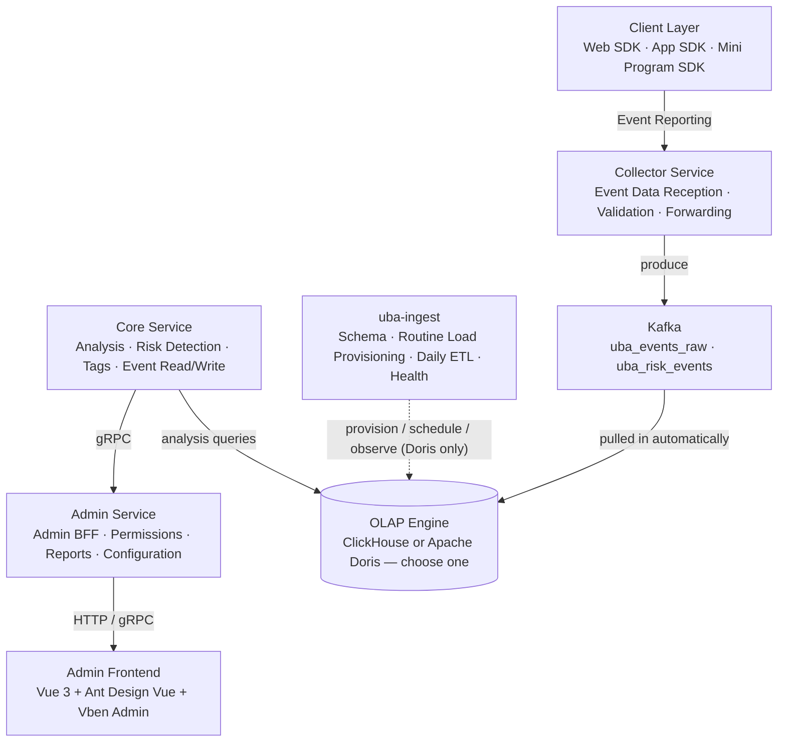

<div align="center">


# GoWind UBA · User Behavior Analytics Platform

**English** | [中文](./README.md) | [日本語](./README_ja.md)

</div>

<p align="center">
  
  
  
  
  
</p>

---

## Highlights

- **25+ Analysis Models**: Covering general behavior analytics (Event/Funnel/Retention/Attribution/Distribution/Path/Segmentation/Click/Attribute/Behavior Sequence), deep user insights (Lifecycle/Churn/Interval/Matrix/Revenue/Session/Anomaly/New-vs-Old/Conversion Paths), and game-specific analytics (Level/Whale Tier/LTV/Server Retention/PCU/Economy) — from basic metrics to deep attribution to game balance analysis in one platform
- **Switchable Dual OLAP Engines**: Native support for both ClickHouse and Apache Doris — deploy either one as needed, with extreme query performance
- **Full-Link Event Collection**: Custom Web SDK with zero-code auto-tracking and custom events, real-time data ingestion via Kafka into data warehouse
- **Multi-Tenancy**: Tenant data isolation with automatic initialization of departments, roles, and administrators — ready out of the box
- **Microservice Architecture**: Built on go-kratos microservice framework with service discovery, distributed tracing, and distributed caching
- **Risk Detection**: Built-in risk rule engine with Webhook real-time alerts to safeguard your business
- **Production Ready**: JWT authentication, Casbin/OPA authorization, SSE push notifications, async task scheduling, Swagger docs, and one-click Docker deployment

---

## What is UBA?

**UBA** (User Behavior Analytics) is a data analysis technique for collecting, analyzing, and reporting user behavior on websites, apps, and other digital products. It helps businesses understand user preferences, habits, and behavioral patterns to optimize product experiences, increase conversion rates, and achieve precision marketing.

> UBA was first applied in e-commerce — analyzing clicks, favorites, and purchases to build user profiles and enable targeted recommendations. It was later adopted in information security, using multi-dimensional, long-cycle correlation analysis and behavioral modeling to detect potential security threats.

In 2015, UBA evolved into **UEBA** (User and Entity Behavior Analytics), extending the analysis scope from users to all entities including devices, applications, and endpoints. It leverages machine learning and statistical models to automatically establish behavioral baselines and precisely identify anomalous behaviors.

---

## Analysis Models

The platform provides 25 analysis models across three categories: general behavior analytics, deep user insights, and game-specific analytics.

### General Behavior Analytics (10)

| Model | Typical Question |
| --- | --- |
| **Event Analysis** | Which channel has the highest user registrations in recent months? What's the trend? |
| **Funnel Analysis** | What's the conversion and drop-off rate from browsing to payment? |
| **Retention Analysis** | What's the retention rate for new users on Day 1, Day 7, and Day 30? |
| **Attribution Analysis** | Which campaign placements attracted users to purchase a product? |
| **Distribution Analysis** | How dependent are individual users on the product? What's the repurchase rate? |
| **User Path Analysis** | How do users navigate your product? Where does the actual path deviate from ideal? |
| **User Segmentation** | Who are the users who purchased in the past 30 days? How to create targeted marketing? |
| **Click Analysis** | Which UI elements do users click on? Which have the highest frequency? Heatmap distribution? |
| **User Attribute Analysis** | What's the registration trend over time? How are users distributed by region? |
| **Behavior Sequence** | A user abandoned without paying. Review their behavior history to identify the cause |

### Deep User Insights (9)

| Model | Typical Question |
| --- | --- |
| **Lifecycle** | DAU is flat, but are new users actually retaining? See the structural health of the user base |
| **Churn & Reactivation** | At what point do users churn for good? What behaviors trigger reactivation? |
| **Interval Analysis** | How long from registration to first payment? Days between two purchases? |
| **Matrix / Quadrant** | Which are core features, which are edge? Identify what to optimize or sunset |
| **Revenue Analysis** | ARPU/ARPPU/pay rate/GMV trends? Channel ROI comparison |
| **Session Analysis** | Avg session duration, bounce rate, P50/P90 duration, session depth |
| **Anomaly Detection** | Which events spiked or dropped yesterday? Suspected tracking loss/failure? |
| **New vs Old** | New user pay rate vs old user pay rate? Behavioral differences? |
| **Conversion Paths** | Most common conversion paths? Which path has the highest conversion rate? |

### Game-Specific (6)

| Model | Typical Question |
| --- | --- |
| **Level Analysis** | Which level has the highest stuck rate? Players churning or content consumed too fast? |
| **Whale Tier** | How much revenue do the top 2% of whales contribute? Does the 80/20 rule hold? |
| **LTV** | Cumulative pay value at Day 7/30/90? Which ad channel brings the highest-LTV players? |
| **Server Retention** | D1/D3/D7 retention by server? Differences between new and old servers? |
| **PCU / ACU** | Peak concurrent users (PCU) and average concurrent users (ACU)? |
| **Economy** | Is the gold/diamond source-sink balanced? Inflation tendency or coin-farming signs? |

---

## Tech Stack

### Backend

| Layer | Technology | Description |
| --- | --- | --- |
| Language | Go 1.25+ | High-performance compiled language |
| Framework | go-kratos v2 | Bilibili open-source microservice framework |
| Dependency Injection | Wire | Compile-time dependency injection |
| ORM | Ent | Go entity framework (PostgreSQL) |
| OLAP Engine | ClickHouse / Apache Doris | Columnar storage for extreme analytical performance |
| Message Queue | Kafka | High-throughput event stream processing |
| Cache | Redis | In-memory database |
| Object Storage | MinIO | S3-compatible object storage |
| Service Registry | Etcd / Consul | Service discovery & configuration |
| Tracing | Jaeger + OpenTelemetry | Distributed observability |
| API Definition | Protobuf + buf.build | Contract-first API design |
| Authorization | Casbin / OPA | Policy-driven access control |
| Async Tasks | Asynq | Redis-based async task queue |
| BI Platform | Apache Superset | Data visualization & reporting |

### Admin Frontend

| Technology | Description |
| --- | --- |
| Vue 3 | Progressive frontend framework |
| TypeScript | Type-safe development |
| Ant Design Vue | Enterprise UI component library |
| Vben Admin | Admin dashboard framework |
| Vite | Next-generation build tool |

### Data Collection SDK

| SDK | Platforms | Description |
| --- | --- | --- |
| Web SDK (TypeScript) | Browser / Node | Web event collection with auto-tracking and custom events, sendBeacon fallback on unload |
| C# SDK (.NET) | Unity (native + WebGL) / Godot 4 / .NET | Game/client tracking with batch reporting and retry fallback, zero-dependency core library |

> For integration instructions, see the [Data Collection SDK Integration Guide](docs/sdk_integration.md).

---

## System Architecture


```mermaid
graph TB
    SDK["Client Layer<br/>Web SDK · App SDK · Mini Program SDK"]
    Collector["Collector Service<br/>Event Data Reception · Validation · Forwarding"]
    Kafka["Kafka<br/>uba_events_raw · uba_risk_events"]
    Core["Core Service<br/>Analysis · Risk Detection · Tags · Event Read/Write"]
    Admin["Admin Service<br/>Admin BFF · Permissions · Reports · Configuration"]
    Frontend["Admin Frontend<br/>Vue 3 + Ant Design Vue + Vben Admin"]
    Ingest["uba-ingest<br/>Schema · Routine Load Provisioning · Daily ETL · Health"]
    OLAP[(OLAP Engine<br/>ClickHouse or Apache Doris — choose one)]

    SDK -->|"Event Reporting"| Collector
    Collector -->|"produce"| Kafka
    Kafka -->|"pulled in automatically"| OLAP
    Ingest -.->|"provision / schedule / observe (Doris only)"| OLAP
    Core -->|"analysis queries"| OLAP
    Core -->|"gRPC"| Admin
    Admin -->|"HTTP / gRPC"| Frontend
```

> Events are not moved by Go code: `Collector` only writes to Kafka, and the OLAP engine pulls them
> in — Doris via **Routine Load**, ClickHouse via **Kafka engine tables + materialized views**.
> `uba-ingest` sets up and watches the Doris pipeline (see "Wire up ingestion" below).

---

## Core Features

### Data Collection & Management

| Feature | Description |
| --- | --- |
| Event Collection | Custom event reporting with zero-code Web SDK integration |
| Application Management | Manage collection apps, generate AppID/AppKey, configure collection parameters |
| Data Sync | The same business model can be deployed to either ClickHouse or Doris, with consistent fields, partitions, indexes, and primary keys |
| Session Management | Auto-correlate user sessions for session-level behavior analysis |

### Analysis Models

| Feature | Description |
| --- | --- |
| Event Analysis | Multi-dimensional event statistics and trend analysis |
| Funnel Analysis | Custom funnel steps with conversion and drop-off rates |
| Retention Analysis | New/active user retention with multiple time granularities |
| Attribution Analysis | Multi-touch attribution to identify key conversion paths |
| Distribution Analysis | User behavior frequency distribution revealing dependency levels |
| Path Analysis | User behavior path visualization for discovering critical paths |
| User Segmentation | Behavior-based user grouping for targeted marketing |
| Click Analysis | UI element click heatmap analysis |
| Attribute Analysis | Multi-dimensional user attribute statistics and trend analysis |
| Behavior Sequence | User behavior timeline for quick issue identification |
| Lifecycle | New/active/retained/churned/reactivated stage distribution |
| Churn & Reactivation | Churn by silent days, reactivation trigger analysis |
| Interval Analysis | Time gap distribution between two events |
| Matrix / Quadrant | Dual-axis four-quadrant for core/edge feature identification |
| Revenue Analysis | ARPU/ARPPU/pay rate/GMV trends |
| Session Analysis | Bounce rate / duration percentile / session depth |
| Anomaly Detection | Event WoW change + 7-day baseline anomaly alerting |
| New vs Old | New/old user composition and behavioral/payment differences |
| Conversion Paths | Top group paths + conversion rates |
| Level Analysis | Pass rate / stuck rate / star rate (game) |
| Whale Tier | Whale/dolphin/minnow tiering + revenue share (game) |
| LTV | Lifetime value, supports channel grouping (game) |
| Server Retention | Retention grouped by server (game) |
| PCU / ACU | Peak and average concurrent users (game) |
| Economy | Currency source-sink balance, inflation monitoring (game) |

### Risk & Security

| Feature | Description |
| --- | --- |
| Risk Rule Engine | Visual risk detection rule configuration with multi-dimensional conditions |
| Risk Event Management | Automated risk event detection with manual review and handling |
| Webhook Alerts | Real-time risk event push notifications to third-party systems |

### Organization & Permissions

| Feature | Description |
| --- | --- |
| Multi-Tenant Management | Tenant data isolation with auto-initialized departments, roles, and admins |
| User Management | Full user lifecycle management with multi-role and multi-department binding |
| Role Management | Fine-grained menu, API, and data permission configuration |
| Permission Management | Permission groups, menu nodes, and button-level access control |
| Dictionary Management | Data dictionary categories and items with linked queries, sorting, import/export |

### System Operations

| Feature | Description |
| --- | --- |
| File Management | Upload to OSS or local storage with preview, download, and delete |
| Cache Management | Real-time cache querying with precise or batch clearing |
| Notifications | Multi-level message categories with targeted user messaging |
| Login Logs | Login success/failure logs with IP, device, and timestamp |
| Operation Logs | Full-chain operation logs with detail tracing |
| Task Scheduling | Scheduled task management with start/pause/execute-now support |

---

## Project Structure

```
go-wind-uba/
├── backend/                            # Backend project
│   ├── api/                            # Protobuf API definitions & generated code
│   │   ├── protos/                     # .proto source files (organized by domain)
│   │   │   ├── admin/                  # Admin service APIs
│   │   │   ├── audit/                  # Audit APIs
│   │   │   ├── authentication/         # Authentication APIs
│   │   │   ├── collector/              # Data collection APIs
│   │   │   ├── dict/                   # Dictionary APIs
│   │   │   ├── identity/               # Identity APIs
│   │   │   ├── internal_message/       # Internal messaging APIs
│   │   │   ├── permission/             # Permission APIs
│   │   │   ├── resource/               # Resource APIs
│   │   │   ├── storage/                # File storage APIs
│   │   │   ├── task/                   # Task APIs
│   │   │   └── uba/                    # UBA core APIs
│   │   └── gen/go/                     # Generated Go code by buf
│   ├── app/                            # Service applications
│   │   ├── admin/service/              # Admin service (Management BFF)
│   │   ├── collector/service/          # Collector service (Event collection BFF)
│   │   └── core/service/               # Core service (Business logic)
│   ├── cmd/                            # Ops command-line tools
│   │   └── uba-ingest/                 # Ingestion provisioning CLI (schema · Routine Load · daily ETL · health)
│   ├── pkg/                            # Shared packages
│   │   ├── authorizer/                 # Authorization engine
│   │   ├── constants/                  # Constants
│   │   ├── crypto/                     # Encryption utilities (AES-GCM)
│   │   ├── dorisinit/                  # Pure logic behind Doris ingestion provisioning (script split · render · decisions)
│   │   ├── jwt/                        # JWT utilities
│   │   ├── metadata/                   # Metadata management
│   │   ├── middleware/                 # Middleware (auth/logging/ent/metadata)
│   │   ├── oss/                        # Object storage (MinIO)
│   │   ├── serviceid/                  # Service identity
│   │   ├── task/                       # Async tasks
│   │   ├── topic/                      # Kafka topic management
│   │   └── utils/                      # General utilities
│   ├── sql/                            # Database scripts
│   │   ├── clickhouse/                 # ClickHouse schema
│   │   ├── doris/                      # Doris schema (Go templates, rendered by uba-ingest)
│   │   └── postgresql/                 # PostgreSQL schema
│   ├── scripts/                        # Deployment scripts
│   │   ├── deploy/                     # PM2 deployment scripts
│   │   ├── docker/                     # Docker deployment scripts
│   │   └── env/                        # Environment setup scripts
│   └── docs/                           # Documentation
├── frontend/                           # Frontend project
│   ├── admin/                          # Admin dashboard (Vue 3 + Vben Admin)
│   └── sdk/web/                        # Web data collection SDK
└── LICENSE                             # MIT License
```

---

## 📚 Documentation

| Document | Description | Audience |
| --- | --- | --- |
| [System Architecture](docs/architecture.md) | Service responsibilities, data flow, storage tiers, key design patterns | Those who want to understand the overall design |
| [Development Guide](docs/development_guide.md) | Code generation pipeline, adding services/entities/analysis aggregates/frontend pages | Developers |
| [SDK Integration Guide](docs/sdk_integration.md) | Get appId/appSecret, SDK selection, reporting protocol, full field set | Tracking integrators |
| [Web SDK Documentation](frontend/sdk/web/uba/README.md) | Full Web SDK API | Web integrators |
| [C# SDK Documentation](sdk/csharp/README.md) | Full C# SDK (Unity/Godot) API | Game/client integrators |
| [Deployment Guide](backend/docs/build_deploy.md) | Build, Docker deployment | Ops |
| [Superset Deployment](backend/docs/deploy_superset.md) | BI visualization platform integration | Data analysts |

---

## Getting Started

### Prerequisites

| Tool | Version |
| --- | --- |
| Go | 1.25+ |
| Node.js | >= 20.10.0 |
| pnpm | >= 9.12.0 |
| Docker | 20.0+ |
| buf | latest |

### Environment Scripts

- **Linux / macOS Development**: `scripts/env/install_unix_dev.sh`
- **Linux / macOS Production**: `scripts/env/install_unix_prod.sh`
- **Windows Development**: `scripts/env/install_windows_dev.ps1`

### Docker Deployment Modes

- **full_deploy (Complete)**: Starts middleware + backend services — ideal for one-click demos or production deployment
- **libs_only (Dependencies only, recommended for development)**: Starts only middleware; run backend services locally in your IDE

### 1. Start Dependency Services

Linux / macOS:

```bash
cd backend

# Grant script execution permissions
chmod +x scripts/**/*.sh

# Start middleware dependencies only (recommended for development)
./scripts/docker/libs_only.sh

# Full deployment (middleware + backend services)
./scripts/docker/full_deploy.sh
```

Windows (PowerShell Administrator):

```powershell
cd backend

# Allow script execution (run once)
Set-ExecutionPolicy RemoteSigned -Scope CurrentUser

# Start middleware dependencies only (recommended for development)
.\scripts\docker\libs_only.ps1

# Full deployment (middleware + backend services)
.\scripts\docker\full_deploy.ps1
```

### 2. Start Backend Services

```bash
cd backend

# Install dependencies
go mod tidy

# Initialize development environment (install protoc plugins and CLI tools)
make init

# Generate code (ent + wire + api + openapi)
make gen

# Build all services
make build

# Run Core Service
go run ./app/core/service/cmd/server/ -c ./app/core/service/configs

# Run Admin Service
go run ./app/admin/service/cmd/server/ -c ./app/admin/service/configs

# Run Collector Service
go run ./app/collector/service/cmd/server/ -c ./app/collector/service/configs
```

### 3. Initialize Databases

PostgreSQL tables are migrated automatically by ent the first time Core starts (`data.database.migrate: true`
in `app/core/service/configs/data.yaml`), so load the dictionary seed **after** step 2 above; on the OLAP
side, pick your engine:

```bash
cd backend

# PostgreSQL (business database): only the dictionary/seed data (schema is auto-migrated)
psql -h localhost -U postgres -d gwubd -f sql/postgresql/default-data.sql

# Optional: demo data
psql -h localhost -U postgres -d gwubd -f sql/postgresql/demo-data.sql

# ClickHouse (analytical engine, choose one with Doris): plain SQL, run in filename order
clickhouse-client --queries-file sql/clickhouse/1_base_tables.sql sql/clickhouse/02_kafka_tables.sql sql/clickhouse/03_aggregate_tables.sql sql/clickhouse/04_indexes.sql sql/clickhouse/05_views.sql

# Doris (analytical engine, choose one with ClickHouse): the scripts contain {{...}} placeholders and cannot be piped in — see uba-ingest apply in the next step
```

### 4. Wire up Ingestion (Doris Routine Load)

Events reported by SDKs are written to Kafka by Collector, and **the move from Kafka into Doris is
done by Doris' own Routine Load** — not writing a Go consumer is a deliberate design choice:
scheduling, concurrency, retries and offsets belong to the FE. Provisioning and observability go
through `uba-ingest`:

```bash
cd backend

# Build the ingestion ops CLI
make ingest

# Create the gw_uba schema and ensure the declared Routine Load jobs run (idempotent; --wait blocks until Doris is ready)
./bin/uba-ingest -c app/core/service/configs apply --wait 5m

# Observe: job state / offset lag / error counters; declared but not consuming -> exit code 1
./bin/uba-ingest -c app/core/service/configs status --json

# Daily roll-ups (a cron equivalent; under Docker the long-running ingest-etl container owns this)
./bin/uba-ingest -c app/core/service/configs etl --loop --at 02:00
```

The DSN and brokers are read only from `configs` or the environment (`UBA_DORIS_DSN` /
`UBA_KAFKA_BROKERS`), never from the command line. The provisioning and the daily roll-up above are
already wired under Docker Compose: `ingest` (one-shot `apply`) and `ingest-etl` (a long-running scheduler whose healthcheck is
`status`). See section 6 of `backend/AGENTS.md` for details and the rules for changing this pipeline.

### 5. Start Frontend

```bash
cd frontend/admin

# Install dependencies
pnpm install

# Start development server
pnpm dev
```

### Common Commands

```bash
cd backend

# Generate Protobuf API code
make api

# Generate OpenAPI documentation
make openapi

# Generate TypeScript code
make ts

# Generate all code (ent + wire + api + openapi)
make gen

# Build all services
make build

# Build the ingestion ops CLI
make ingest

# Run tests
make test

# Lint code
make lint

# Start middleware dependencies via Docker Compose
make docker-libs

# Full Docker Compose deployment
make docker-up
```

---

## Backend Services

| Service | Description | Ports |
| --- | --- | --- |
| **Core Service** | Core business service handling event storage, analysis modeling, risk detection, tag management, and data synchronization | gRPC: dynamic port (via etcd service discovery) |
| **Admin Service** | Admin dashboard BFF providing user management, permissions, configuration, and reporting APIs | HTTP: 5600 / SSE: 5601 |
| **Collector Service** | Event collection BFF receiving client-side event data, validating, and forwarding to message queue | HTTP: 5700 |

---

## OLAP Engine Selection & Schema Design

- **ClickHouse and Apache Doris are mutually exclusive**, but the `data.UseClickHouse` switch is currently a **compile-time constant `false`** in `internal/data/data.go`: the ClickHouse branch is compiled out and only Doris actually runs. Switching engines means editing that constant and rebuilding — and the ClickHouse side still has known defects (see the "dual engine" section of `docs/architecture.md`)
- Both engines share the same business model with consistent fields, partitions, indexes, and primary keys
- Automatic struct generation with annotation processing (json, ch tags)
- Batch data ingestion with auto-fill for NOT NULL fields in strict mode
- Post-ingestion optimization for field types, indexes, and partitions — see `backend/sql/` scripts

---

## SDK Integration

> For the full integration process (creating an app to get appId/appSecret, choosing an SDK, reporting protocol), see the
> [Data Collection SDK Integration Guide](docs/sdk_integration.md).

### Web SDK Quick Start

```ts
import { UbaClient } from '@go-wind-uba/uba-sdk';

// Initialize (singleton; appId/appSecret are obtained after creating an app under "Application Management" in the admin backend)
const uba = UbaClient.init({
  appId: 'your_app_id',
  appSecret: 'your_app_secret',
  endpoint: 'http://localhost:5700', // collector service address
});

// Set super properties (automatically attached to every subsequent event)
uba.setSuperProperties({ platform: 'web', version: '1.0.0' });

// Track a custom event
uba.track('page_view', { page: '/home', title: 'Home' });

// Bind the user after login
uba.identify(1001);
uba.track('purchase', { orderId: 'ORD-001' }, { amount: '99.90', quantity: 1 });
```

> See the [Web SDK Documentation](frontend/sdk/web/uba/README.md) for details.

### C# SDK (Unity / Godot)

```csharp
using Uba;

var client = new UbaClient(new UbaConfig {
    AppId = "your_app_id",
    AppSecret = "your_app_secret",
    Endpoint = "http://localhost:5700",
});

client.Track("scene_load", new() { ["scene"] = "Main" });
```

> Unity WebGL must use `UnityWebRequestTransport` (HttpClient is unavailable in WebGL).
> See the [C# SDK Documentation](sdk/csharp/README.md) for details.

---

## References

- [ZhuLong-BI (User Event Analysis Platform)](https://www.yuque.com/jianghurenchenggolang/oehqme/hen7qy#JFdyf)
- [AARRR Model for Product Managers](https://www.woshipm.com/operate/5460612.html)
- [User Behavior Analytics vs BI — The Difference](https://www.niutoushe.com/54408)
- [Key Points for User Behavior Analysis](https://www.fanruan.com/bw/zwoz)
- [What is Business Intelligence (BI)?](https://www.sap.cn/products/technology-platform/cloud-analytics/what-is-business-intelligence-bi.html)
- [Business Intelligence in Microservices: Improving Performance](https://dzone.com/articles/business-intelligence-in-microservices-improving-p)
- [ClickHouse Real-Time Application and Optimization](https://mp.weixin.qq.com/s/hqUCFSr8cu3x3u8HCA6WYg)
- [From Maintaining Hundreds of Tables to One — UEI Model](https://zhuanlan.zhihu.com/p/623182999)

---

## Related Projects

- [go-wind-admin](https://github.com/tx7do/go-wind-admin) — Out-of-the-box enterprise admin scaffold
- [go-wind-cms](https://github.com/tx7do/go-wind-cms) — Out-of-the-box enterprise headless content platform

---

## Contact

- WeChat: yang_lin_bo (mention: go-wind-uba)

---

## License

This project is licensed under the [MIT License](LICENSE).

## Acknowledgements

[](https://jb.gg/OpenSource)

Thanks to JetBrains for providing free GoLand & WebStorm open-source licenses.
