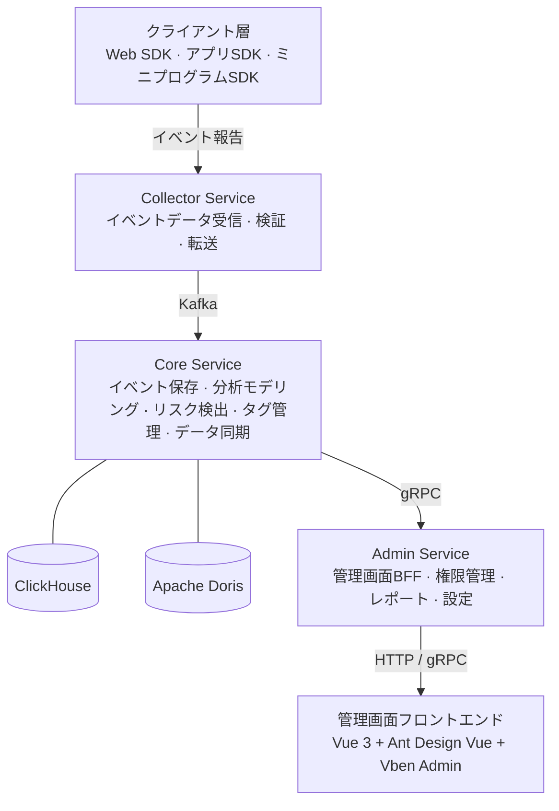

<p align="center">
  <h1 align="center">GoWind UBA · ユーザー行動分析プラットフォーム</h1>
  <p align="center">
    すぐに使えるエンタープライズグレードのユーザー行動分析・ビジネスインテリジェンスプラットフォーム
  </p>
  <p align="center">
    <em>すべてのユーザー行動を追跡可能に、すべてのデータインサイトを手軽に</em>
  </p>
</p>

<p align="center">
  <a href="README.md">中文</a> · <a href="README_en.md">English</a> · <a href="README_ja.md">日本語</a>
</p>

<p align="center">
  
  
  
  
  
</p>

---

## プロジェクトの特徴

- **10の分析モデル**：イベント分析、ファネル分析、リテンション分析、アトリビューション分析、分布分析、ユーザーパス分析、ユーザーセグメンテーション、クリック分析、ユーザー属性分析、行動シーケンス分析 — ユーザー行動分析の全シナリオをカバー
- **デュアルOLAPエンジン**：ClickHouseとApache Dorisの両方をネイティブサポート、自由に切り替え可能、極致のクエリパフォーマンス
- **フルリンクイベント収集**：独自開発のWeb SDK、ゼロコードトラッキング＋カスタムイベント、Kafka経由でリアルタイムにデータウェアハウスへ書き込み
- **マルチテナントアーキテクチャ**：テナントデータの物理的隔離、部門・ロール・管理者の自動初期化、すぐに使用可能
- **マイクロサービスアーキテクチャ**：go-kratosマイクロサービスフレームワークに基づき、サービスディスカバリ、分散トレーシング、分散キャッシュをサポート
- **リスク検出**：内蔵リスクルールエンジン、Webhookリアルタイムアラートでビジネスの安全を守る
- **プロダクションレディ**：JWT認証、Casbin/OPA認可エンジン、SSEプッシュ通知、非同期タスクスケジューリング、Swaggerドキュメント、Dockerワンクリックデプロイ

---

## UBAとは？

**UBA**（User Behavior Analytics、ユーザー行動分析）は、ウェブサイトやアプリなどのデジタルプロダクトにおけるユーザーの行動を収集・分析・報告するデータ分析技術です。企業がユーザーの嗜好、習慣、行動パターンを理解し、プロダクト体験の最適化、コンバージョン率の向上、精密なマーケティングを実現するのに役立ちます。

> UBAは最初、Eコマース分野で応用されました。クリック、お気に入り、購入などの行動を分析し、ユーザープロファイリングとターゲットマーケティング推薦を実現しました。その後、情報セキュリティ分野に導入され、多次元・長期間の相関分析と行動モデリングにより潜在的なセキュリティ脅威を発見するようになりました。

2015年、UBAは**UEBA**（User and Entity Behavior Analytics、ユーザーおよびエンティティ行動分析）に進化し、分析範囲をユーザーからデバイス、アプリケーション、エンドポイントなどのすべてのエンティティに拡大しました。機械学習と統計モデルを活用して行動ベースラインを自動的に確立し、異常行動を正確に特定します。

---

## 分析モデル

| モデル | 典型的な質問 |
| --- | --- |
| **イベント分析** | 過去数ヶ月で、どのチャネルのユーザー登録が最も多いか？推移は？ |
| **ファネル分析** | 商品閲覧から支払いクリックまでのコンバージョンと離脱状況は？ |
| **リテンション分析** | 新規ユーザーの1日目、7日目、30日目のリテンション率は？ |
| **アトリビューション分析** | どの運用枠がユーザーを引き付け、商品を購入させたのか？ |
| **分布分析** | 個々のユーザーのプロダクトへの依存度、リピート購入率は？ |
| **ユーザーパス分析** | ユーザーはどのようにプロダクトを閲覧しているか？理想パスとの乖離は？ |
| **ユーザーセグメンテーション** | 過去30日間に商品を購入したユーザーは誰か？ターゲットマーケティング戦略は？ |
| **クリック分析** | ユーザーがクリックしたUI要素は？最も高頻度でクリックされる要素は？ |
| **ユーザー属性分析** | 登録ユーザー数の推移は？都道府県別のユーザー分布は？ |
| **行動シーケンス分析** | ユーザーが支払わずに離脱。行動履歴を確認し、離脱原因を迅速に特定 |

---

## 技術スタック

### バックエンド

| レイヤー | 技術 | 説明 |
| --- | --- | --- |
| 言語 | Go 1.25+ | 高性能コンパイル言語 |
| フレームワーク | go-kratos v2 | Bilibiliオープンソースマイクロサービスフレームワーク |
| 依存性注入 | Wire | コンパイル時依存性注入 |
| ORM | Ent | Goエンティティフレームワーク（PostgreSQL） |
| OLAPエンジン | ClickHouse / Apache Doris | カラムナストレージ、極致の分析パフォーマンス |
| メッセージキュー | Kafka | 高スループットイベントストリーム処理 |
| キャッシュ | Redis | インメモリデータベース |
| オブジェクトストレージ | MinIO | S3互換オブジェクトストレージ |
| サービスレジストリ | Etcd / Consul | サービスディスカバリと設定 |
| トレーシング | Jaeger + OpenTelemetry | 分散オブザーバビリティ |
| API定義 | Protobuf + buf.build | コントラクトファーストAPI設計 |
| 認可エンジン | Casbin / OPA | ポリシー駆動アクセス制御 |
| 非同期タスク | Asynq | Redisベースの非同期タスクキュー |
| BIプラットフォーム | Apache Superset | データ可視化とレポート |

### 管理画面フロントエンド

| 技術 | 説明 |
| --- | --- |
| Vue 3 | プログレッシブフロントエンドフレームワーク |
| TypeScript | 型安全な開発 |
| Ant Design Vue | エンタープライズUIコンポーネントライブラリ |
| Vben Admin | 管理ダッシュボードフレームワーク |
| Vite | 次世代ビルドツール |

### データ収集SDK

| SDK | 説明 |
| --- | --- |
| Web SDK (JavaScript) | ブラウザイベント収集、自動トラッキングとカスタムイベント対応 |

---

## システムアーキテクチャ



---

## コア機能

### データ収集・管理

| 機能 | 説明 |
| --- | --- |
| イベント収集 | カスタムイベント報告、Web SDKゼロコード統合 |
| アプリケーション管理 | 収集アプリ管理、AppID/AppKey生成、収集パラメータ設定 |
| データ同期 | ClickHouse ↔ Doris 双方向スキーマ自動同期、フィールド・パーティション・インデックスの整合性維持 |
| セッション管理 | ユーザーセッションの自動関連付け、セッションレベルの行動分析 |

### 分析モデル

| 機能 | 説明 |
| --- | --- |
| イベント分析 | 多次元イベント統計とトレンド分析 |
| ファネル分析 | カスタムファネルステップ、コンバージョン率と離脱率の計算 |
| リテンション分析 | 新規/アクティブユーザーのリテンション、複数時間粒度対応 |
| アトリビューション分析 | マルチタッチアトリビューション、主要コンバージョンパスの特定 |
| 分布分析 | ユーザー行動頻度分布、依存度の可視化 |
| パス分析 | ユーザー行動パスの可視化、クリティカルパスの発見 |
| ユーザーセグメンテーション | 行動に基づくユーザーグルーピング、ターゲットマーケティング |
| クリック分析 | UI要素のクリックヒートマップ分析 |
| 属性分析 | 多次元ユーザー属性統計とトレンド分析 |
| 行動シーケンス | ユーザー行動タイムライン、迅速な問題特定 |

### リスク・セキュリティ

| 機能 | 説明 |
| --- | --- |
| リスクルールエンジン | ビジュアルリスク検出ルール設定、多次元条件の組み合わせ |
| リスクイベント管理 | 自動リスクイベント検出、手動レビューと処理 |
| Webhookアラート | リスクイベントのサードパーティシステムへのリアルタイムプッシュ |

### 組織・権限

| 機能 | 説明 |
| --- | --- |
| マルチテナント管理 | テナントデータ隔離、部門・ロール・管理者の自動初期化 |
| ユーザー管理 | ユーザーライフサイクル全体の管理、複数ロール・複数部門バインディング |
| ロール管理 | メニュー権限、API権限、データ権限のきめ細かな設定 |
| 権限管理 | 権限グループ、メニューノード、ボタンレベルのアクセス制御 |
| 辞書管理 | データ辞書カテゴリとアイテム管理、連動クエリ、ソート、インポート/エクスポート |

### システム運用

| 機能 | 説明 |
| --- | --- |
| ファイル管理 | OSSまたはローカルストレージへのアップロード、プレビュー、ダウンロード、削除 |
| キャッシュ管理 | リアルタイムキャッシュクエリ、個別または一括クリア |
| メッセージ通知 | 多レベルメッセージカテゴリ、特定ユーザーへのメッセージ送信 |
| ログインログ | ログイン成功/失敗ログ、IP、デバイス、タイムスタンプ付き |
| 操作ログ | フルチェーン操作ログ、詳細トレーシング |
| タスクスケジューリング | スケジュールタスク管理、開始/一時停止/即時実行対応 |

---

## プロジェクト構成

```
go-wind-uba/
├── backend/                            # バックエンドプロジェクト
│   ├── api/                            # Protobuf API定義と生成コード
│   │   ├── protos/                     # .protoソースファイル（ドメイン別）
│   │   │   ├── admin/                  # 管理サービスAPI
│   │   │   ├── audit/                  # 監査API
│   │   │   ├── authentication/         # 認証API
│   │   │   ├── collector/              # データ収集API
│   │   │   ├── dict/                   # 辞書API
│   │   │   ├── identity/               # アイデンティティAPI
│   │   │   ├── internal_message/       # 内部メッセージングAPI
│   │   │   ├── permission/             # 権限API
│   │   │   ├── resource/               # リソースAPI
│   │   │   ├── storage/                # ファイルストレージAPI
│   │   │   ├── task/                   # タスクAPI
│   │   │   └── uba/                    # UBAコアAPI
│   │   └── gen/go/                     # bufで生成されたGoコード
│   ├── app/                            # サービスアプリケーション
│   │   ├── admin/service/              # Adminサービス（管理画面BFF）
│   │   ├── collector/service/          # Collectorサービス（イベント収集BFF）
│   │   └── core/service/               # Coreサービス（ビジネスロジック）
│   ├── pkg/                            # 共有パッケージ
│   │   ├── authorizer/                 # 認可エンジン
│   │   ├── constants/                  # 定数
│   │   ├── crypto/                     # 暗号化ユーティリティ（AES-GCM）
│   │   ├── jwt/                        # JWTユーティリティ
│   │   ├── metadata/                   # メタデータ管理
│   │   ├── middleware/                 # ミドルウェア（認可/ログ/ent/メタデータ）
│   │   ├── oss/                        # オブジェクトストレージ（MinIO）
│   │   ├── serviceid/                  # サービス識別
│   │   ├── task/                       # 非同期タスク
│   │   ├── topic/                      # Kafkaトピック管理
│   │   └── utils/                      # 汎用ユーティリティ
│   ├── sql/                            # データベーススクリプト
│   │   ├── clickhouse/                 # ClickHouseスキーマ
│   │   ├── doris/                      # Dorisスキーマ
│   │   └── postgresql/                 # PostgreSQLスキーマ
│   ├── scripts/                        # デプロイスクリプト
│   │   ├── deploy/                     # PM2デプロイスクリプト
│   │   ├── docker/                     # Dockerデプロイスクリプト
│   │   └── env/                        # 環境セットアップスクリプト
│   └── docs/                           # ドキュメント
├── frontend/                           # フロントエンドプロジェクト
│   ├── admin/                          # 管理画面（Vue 3 + Vben Admin）
│   └── sdk/web/                        # Webデータ収集SDK
└── LICENSE                             # MITライセンス
```

---

## クイックスタート

### 前提条件

| ツール | バージョン |
| --- | --- |
| Go | 1.25+ |
| Node.js | >= 20.10.0 |
| pnpm | >= 9.12.0 |
| Docker | 20.0+ |
| buf | 最新版 |

### 環境セットアップスクリプト

- **Linux / macOS 開発環境**：`scripts/env/install_unix_dev.sh`
- **Linux / macOS 本番環境**：`scripts/env/install_unix_prod.sh`
- **Windows 開発環境**：`scripts/env/install_windows_dev.ps1`

### Dockerデプロイモード

- **full_deploy（完全モード）**：ミドルウェア＋バックエンドサービスを同時起動、ワンクリックデモ・本番デプロイに適しています
- **libs_only（依存のみ、開発推奨）**：ミドルウェアのみ起動、バックエンドサービスはIDEでローカル実行

### 1. 依存サービスの起動

Linux / macOS：

```bash
cd backend

# スクリプトに実行権限を付与
chmod +x scripts/**/*.sh

# ミドルウェアのみ起動（開発推奨）
./scripts/docker/libs_only.sh

# 完全デプロイ（ミドルウェア + バックエンドサービス）
./scripts/docker/full_deploy.sh
```

Windows（PowerShell 管理者）：

```powershell
cd backend

# スクリプト実行ポリシーの許可（初回のみ）
Set-ExecutionPolicy RemoteSigned -Scope CurrentUser

# ミドルウェアのみ起動（開発推奨）
.\scripts\docker\libs_only.ps1

# 完全デプロイ（ミドルウェア + バックエンドサービス）
.\scripts\docker\full_deploy.ps1
```

### 2. バックエンドサービスの起動

```bash
cd backend

# 依存関係のインストール
go mod tidy

# 開発環境の初期化（protocプラグインとCLIツールのインストール）
make init

# コード生成（ent + wire + api + openapi）
make gen

# 全サービスのビルド
make build

# Coreサービスの起動
go run ./app/core/service/cmd/server/ -c ./app/core/service/configs

# Adminサービスの起動
go run ./app/admin/service/cmd/server/ -c ./app/admin/service/configs

# Collectorサービスの起動
go run ./app/collector/service/cmd/server/ -c ./app/collector/service/configs
```

### 3. データベースの初期化

`sql/` ディレクトリのスキーマスクリプトを実行：

```bash
# PostgreSQL（業務データベース）
psql -h localhost -U postgres -d gwubd -f sql/postgresql/schema.sql

# ClickHouse（分析エンジン）
clickhouse-client --queries-file sql/clickhouse/schema.sql

# Doris（分析エンジン）
mysql -h localhost -P 9030 -u root < sql/doris/schema.sql
```

### 4. フロントエンドの起動

```bash
cd frontend/admin

# 依存関係のインストール
pnpm install

# 開発サーバーの起動
pnpm dev
```

### よく使うコマンド

```bash
cd backend

# Protobuf APIコードの生成
make api

# OpenAPIドキュメントの生成
make openapi

# TypeScriptコードの生成
make ts

# 全コード生成（ent + wire + api + openapi）
make gen

# 全サービスのビルド
make build

# テストの実行
make test

# リント
make lint

# Docker Composeでミドルウェア起動
make docker-libs

# Docker Compose完全デプロイ
make docker-up
```

---

## バックエンドサービス

| サービス | 説明 | ポート |
| --- | --- | --- |
| **Core Service** | コアビジネスサービス。イベント保存、分析モデリング、リスク検出、タグ管理、データ同期などの主要ロジックを担当 | - |
| **Admin Service** | 管理画面BFF。ユーザー管理、権限管理、設定管理、レポート照会などのAPIを提供 | HTTP: 9700 / gRPC: 9701 |
| **Collector Service** | イベント収集BFF。クライアントからのイベントデータを受信し、検証後にメッセージキューに転送 | HTTP: 9800 / gRPC: 9801 |

---

## データ同期とスキーマ設計

- ClickHouseとDoris間の双方向スキーマ自動同期、フィールド・パーティション・インデックス・主キーの整合性維持
- struct定義の自動生成、アノテーション（json、ch）の自動処理
- バッチデータ同期と挿入、strictモードでのNOT NULLフィールドの自動補完
- 同期後のフィールドタイプ・インデックス・パーティションの最適化は `backend/sql/` スクリプトを参照

---

## Web SDK統合

```html
<script type="text/javascript" src="report_sdk.js"></script>
<script type="text/javascript">
    // 初期化（シングルトンパターン）
    // パラメータ：収集サービスURL, AppID, AppKey, デバッグモード
    // デバッグモード：0=通常, 1=テスト（保存あり）, 2=テスト（保存なし）
    const tracker = new EventReport(
        "http://localhost:9800",
        "your_app_id",
        "your_app_key",
        0
    );

    // グローバルプロパティの設定
    tracker.setSuperProperties({ platform: "web", version: "1.0.0" });

    // カスタムイベントのトラッキング
    tracker.track("page_view", { page: "/home", title: "ホームページ" });

    // ユーザー属性の報告
    tracker.userSet({ name: "田中太郎", vip_level: 3 }).trackUserData();
</script>
```

> 詳細は [Web SDKドキュメント](frontend/sdk/web/README.md) を参照してください。

---

## 関連プロジェクト

- [go-wind-admin](https://github.com/tx7do/go-wind-admin) — すぐに使えるエンタープライズグレード管理画面スキャフォールド
- [go-wind-cms](https://github.com/tx7do/go-wind-cms) — すぐに使えるエンタープライズグレードヘッドレスコンテンツプラットフォーム

---

## お問い合わせ

- WeChat: yang_lin_bo（備考：go-wind-uba）

---

## ライセンス

このプロジェクトは [MIT License](LICENSE) の下で公開されています。

## 謝辞

[](https://jb.gg/OpenSource)

JetBrainsより無料のGoLand & WebStormオープンソースライセンスを提供していただき、感謝申し上げます。
