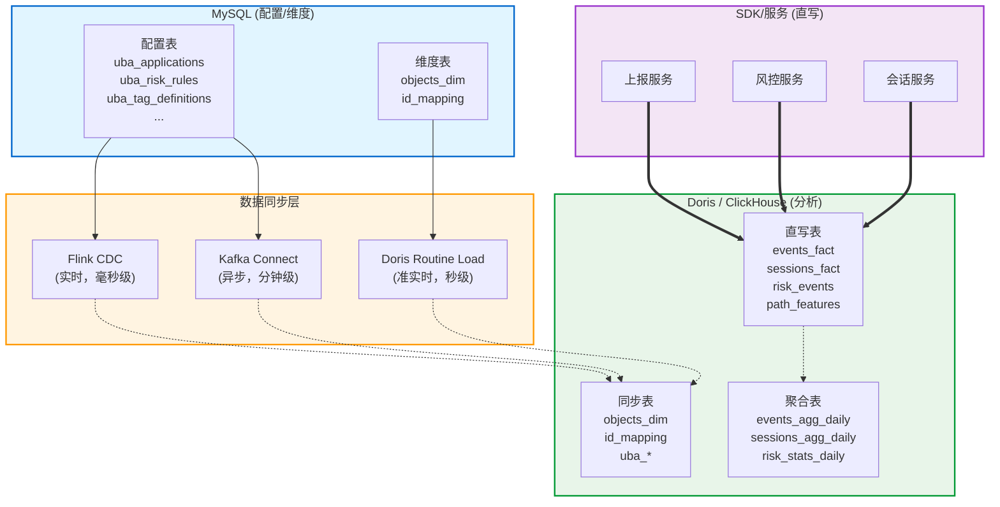

# Data

## 同步需求总览

| 表名                           | 表类型 | 主存储                | 是否双写 | 是否同步 | 同步方向         | 同步方式             | 优先  |
|------------------------------|-----|--------------------|------|------|--------------|------------------|-----|
| **事实表**                      | 事实表 | Doris / CH         | ❌ 否  | ❌ 否  | N/A          | N/A              | N/A |
| `events_fact`                | 事实表 | Doris / CH         | ❌ 否  | ❌ 否  | N/A          | N/A              | N/A |
| `sessions_fact`              | 事实表 | Doris / CH         | ❌ 否  | ❌ 否  | N/A          | N/A              | N/A |
| `risk_events`                | 事实表 | Doris / CH         | ❌ 否  | ❌ 否  | N/A          | N/A              | N/A |
| `path_features`              | 事实表 | Doris / CH         | ❌ 否  | ❌ 否  | N/A          | N/A              | N/A |
| **维度表**                      |     |                    |      |      |              |                  |     |
| `users_dim`                  | 维度表 | Doris / CH         | ❌ 否  | ❌ 否  | N/A          | OLAP 内聚合         | N/A |
| `objects_dim`                | 维度表 | MySQL / Postgresql | ✅ 是  | ✅ 是  | MySQL → OLAP | CDC/Routine Load | P0  |
| `id_mapping`                 | 维度表 | MySQL / Postgresql | ✅ 是  | ✅ 是  | MySQL → OLAP | CDC/Routine Load | P0  |
| `user_tags`                  | 维度表 | Doris / CH         | ❌ 否  | ❌ 否  | N/A          | N/A              | N/A |
| **聚合表**                      |     |                    |      |      |              |                  |     |
| `events_agg_daily`           | 聚合表 | Doris / CH         | ❌ 否  | ❌ 否  | N/A          | 物化视图自动           | N/A |
| `sessions_agg_daily`         | 聚合表 | Doris / CH         | ❌ 否  | ❌ 否  | N/A          | 物化视图自动           | N/A |
| `risk_stats_daily`           | 聚合表 | Doris / CH         | ❌ 否  | ❌ 否  | N/A          | 物化视图自动           | N/A |
| `popular_paths_daily`        | 聚合表 | Doris / CH         | ❌ 否  | ❌ 否  | N/A          | 物化视图自动           | N/A |
| `user_tags_agg`              | 聚合表 | Doris / CH         | ❌ 否  | ❌ 否  | N/A          | 物化视图自动           | N/A |
| **配置表 (MySQL / Postgresql)** |     |                    |      |      |              |                  |     |
| `uba_applications`           | 配置表 | MySQL / Postgresql | ✅ 是  | ✅ 是  | MySQL → OLAP | CDC/Routine Load | P0  |
| `uba_risk_rules`             | 配置表 | MySQL / Postgresql | ✅ 是  | ✅ 是  | MySQL → OLAP | CDC/Routine Load | P0  |
| `uba_risk_rule_conditions`   | 配置表 | MySQL / Postgresql | ✅ 是  | ✅ 是  | MySQL → OLAP | CDC/Routine Load | P0  |
| `uba_tag_definitions`        | 配置表 | MySQL / Postgresql | ✅ 是  | ✅ 是  | MySQL → OLAP | CDC/Routine Load | P0  |
| `uba_tag_values`             | 配置表 | MySQL / Postgresql | ✅ 是  | ✅ 是  | MySQL → OLAP | CDC/Routine Load | P1  |
| `uba_webhooks`               | 配置表 | MySQL / Postgresql | ✅ 是  | ✅ 是  | MySQL → OLAP | CDC/Routine Load | P1  |

## 详细同步方案

### 1. 需要同步的表（MySQL → OLAP）

| 表名                         | 同步原因                          | 同步频率    | 同步工具                           | 备注           |
|----------------------------|-------------------------------|---------|--------------------------------|--------------|
| `objects_dim`              | 对象元数据在 MySQL 维护，OLAP 查询需 JOIN | 实时/准实时  | Doris Routine Load / Flink CDC | 变更频率低        |
| `id_mapping`               | ID 关联关系在 MySQL 维护，OLAP 需关联查询  | 实时/准实时  | Doris Routine Load / Flink CDC | 变更频率中        |
| `uba_applications`         | 应用配置在 MySQL，OLAP 需鉴权/路由       | 实时      | Doris Routine Load / Flink CDC | 变更频率低        |
| `uba_risk_rules`           | 风控规则在 MySQL，OLAP 需实时匹配        | **毫秒级** | Flink CDC + Kafka              | 变更频率低，但要求高时效 |
| `uba_risk_rule_conditions` | 规则条件在 MySQL，OLAP 需实时匹配        | **毫秒级** | Flink CDC + Kafka              | 变更频率低，但要求高时效 |
| `uba_tag_definitions`      | 标签定义在 MySQL，OLAP 需展示标签名       | 准实时     | Doris Routine Load / Flink CDC | 变更频率低        |
| `uba_tag_values`           | 标签枚举值在 MySQL，OLAP 需展示         | 准实时     | Doris Routine Load / Flink CDC | 变更频率低        |
| `uba_webhooks`             | Webhook 配置在 MySQL，OLAP 需触发通知  | 实时      | Flink CDC + Kafka              | 变更频率低        |

### 2. 不需要同步的表（直接写入 OLAP）

| 表名              | 原因                | 写入方式                               |
|-----------------|-------------------|------------------------------------|
| `events_fact`   | 高吞吐行为数据，直接写入 OLAP | SDK → Kafka → Doris/CH Stream Load |
| `sessions_fact` | 会话聚合数据，直接写入 OLAP  | 服务层 → Doris/CH Stream Load         |
| `risk_events`   | 风险事件数据，直接写入 OLAP  | 风控服务 → Doris/CH Stream Load        |
| `path_features` | 路径特征数据，直接写入 OLAP  | 路径计算服务 → Doris/CH Stream Load      |
| `users_dim`     | 用户画像由 OLAP 聚合计算生成 | OLAP 内 INSERT INTO SELECT          |
| `user_tags`     | 标签关联由 OLAP 聚合计算生成 | OLAP 内 INSERT INTO SELECT          |
| 所有聚合表           | 由物化视图自动聚合         | 物化视图自动维护                           |

### 同步架构设计

